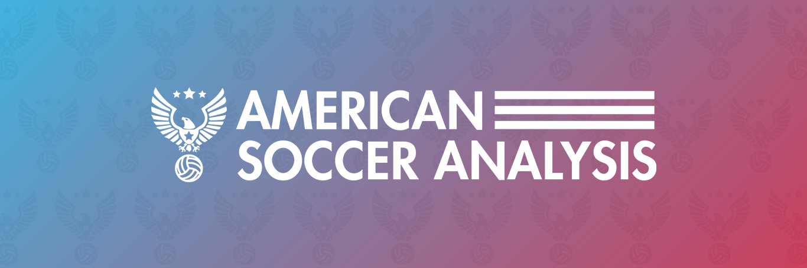

# American Soccer Analysis | Shiny App

<p align="center">

</p>

## About the App

We built this interactive web application to give ASA's loyal readers more autonomy to sort, filter, and download our data. It features summary-level data of teams and players participating in the following competitions: 

- Major League Soccer (MLS)
- National Women's Soccer League (NWSL)
- USL Championship
- USL League One
- MLS Next Pro
- North American Soccer League (NASL)

## Running the app via Docker

```sh
docker build -t asa-shiny .
docker run -p 80:80 asa-shiny
```

## Contributing

If you'd like to report a bug or request a new feature, please use the [Issues tab](https://github.com/American-Soccer-Analysis/asa-shiny-app/issues) in this repository.

Alternatively, if you'd like to help us squash bugs or add new features, drop us a message first! From there, follow [these general guidelines](https://github.com/MarcDiethelm/contributing/blob/master/README.md) for making a clean pull request. When you clone the forked repository to your local machine, use [`renv::restore()`](https://rstudio.github.io/renv/articles/renv.html) to recreate the virtual R environment.

## Acknowledgments

Thanks to the developers of these integral, open source libraries:

- [`bs4Dash`](https://github.com/RinteRface/bs4Dash)
- [`shiny`](https://github.com/rstudio/shiny)
- [`shinyjs`](https://github.com/daattali/shinyjs)
- [`shinyWidgets`](https://github.com/dreamRs/shinyWidgets)
- [`shinycssloaders`](https://github.com/daattali/shinycssloaders)
- [`shiny.router`](https://github.com/Appsilon/shiny.router)
- [`jsonlite`](https://github.com/jeroen/jsonlite)
- [`httr`](https://github.com/r-lib/httr)
- [`r2d3`](https://github.com/rstudio/r2d3)
- [`DT`](https://github.com/rstudio/DT)
- [`tidyverse`](https://github.com/tidyverse/tidyverse)

## Attribution

This application was built and is maintained by [Brian Greenwood](https://github.com/bgrnwd), [Matthias Kullowatz](https://github.com/mattyanselmo), [Rory Pulvino](https://github.com/rvino), and [Tyler Richardett](https://github.com/tyler-richardett).

If you use any of the data we make publicly available, we kindly ask that you provide credit and link back to the [American Soccer Analysis website](https://www.americansocceranalysis.com/). Thanks!

